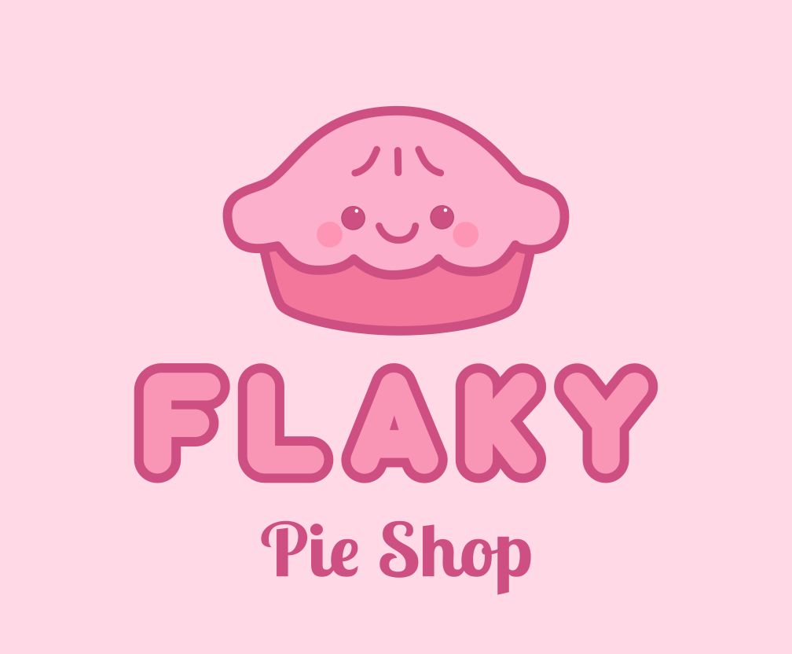
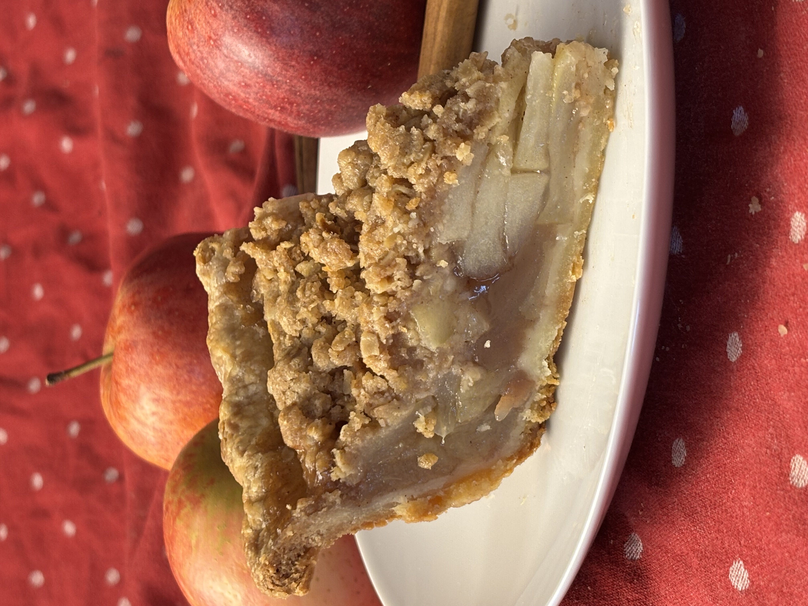
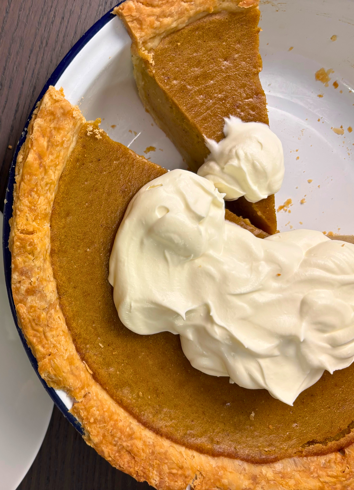
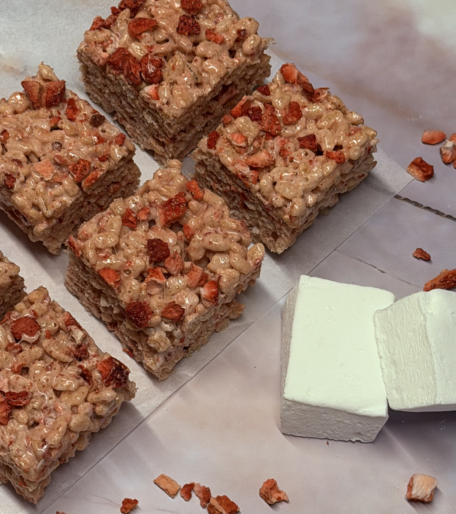
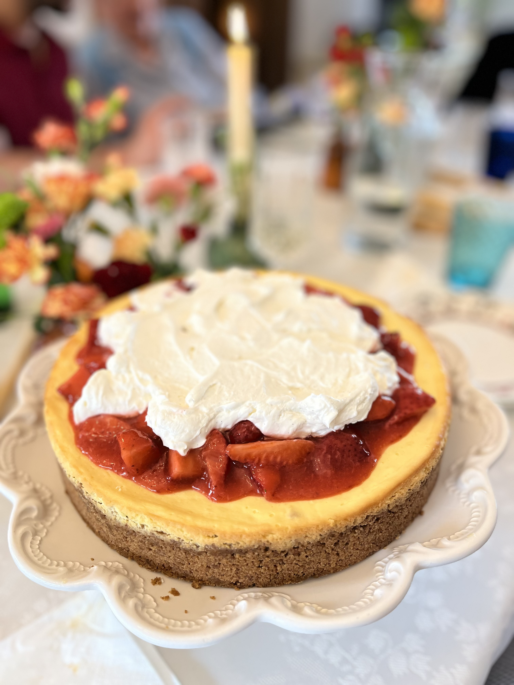

<!-- Desktop background video -->

  <video autoplay muted loop playsinline>
    <source src="Backgroundrotating2.mp4" type="video/mp4">
  </video>

<!-- INTRO PANEL (PINK BACKGROUND) -->

{fig-align="center" width="642" alt="Flaky — American-style pie bakery in Zürich"}

Flaky is a cozy home-based microbakery in the Zürich area making **American-style pies and treats**—from buttery, flaky crusts to chewy and sweet rice krispie treats. Everything is handmade with high-quality Swiss ingredients. **Order online** for **pickup in Wallisellen**. Seasonal favorites include pumpkin, pecan, apple & key lime.

 <!-- end content-strip -->

<!-- MAIN CONTENT AREA -->

# Products {#products}

**American sweets are pure happiness** — simple and full of flavor. The tang of buttermilk and cream cheese, the sweetness of maple syrup, and all that buttery goodness… they take me right back to my childhood. They’re not about perfection — they’re about **warmth, joy, and the feeling of home.**

And pies? The **flakiness of a pie crust** combined with a sweet and creamy filling or a fragrant fruit is just joy.

Every pie and treat is **baked fresh to order** — I only bake after a reservation, so each creation gets the care and time it deserves. Whether you’re craving something familiar or want to try a new twist on a classic, I’ll bake it with love — just for you.

<!-- WHITE BACKGROUND SECTION -->
<section id="pie-section">

<!-- Apple Crumble Pie -->

<a href="cinnamon-apple-crumble-pie-zurich.html"><h4>Cinnamon Apple Crumble Pie</h4></a>

Cozy spiced apples tucked under a buttery crumble.

<!-- Chocolate Pecan Pie -->

<a href="pecan-pie-zurich.html"><h4>Chocolat-y Pecan Pie</h4></a>

The richness of dark chocolate with toasty pecans and a hint of salt.

 <!-- end pie-list -->

 <!-- end gallery -->

<!-- Pumpkin Pie -->

<a href="pumpkin-pie-thanksgiving-zurich.html"><h4>Pumpkin Pie</h4></a>

As we're approaching the end of pumpkin season, availability is limited. Get in touch!

 <!-- end pie-list -->

<!-- Rice Krispies -->

<a href="rice-krispies-treats-zurich.html"><h4>Rice Krispies Treats</h4></a>

The chewy treat that's nostalgic to everyone, flavoured of sesame, strawberry of chocolate

<!-- Custom Order -->

<a href="custom-pie-cake-zurich.html"><h4>Custom Order</h4></a>

Special flavors, mini treats, occasion pies — I’ll bake your idea with love!

 <!-- end pie-list -->

</section> <!-- END PIE SECTION (white background) -->

  <a href="order-pies-zurich.qmd" class="btn-link">Prices and Order</a>

# About {#about}

Hi, I’m Marianna 👋  
I’m a researcher by profession — and a pastry chef by heart.

Originally from Italy, I trained and became certified in professional pastry before moving to Switzerland in 2016. Growing up, I spent much of my childhood travelling through the USA, where I fell in love with flaky American pies and treats.

Now, as a new mom, I’ve opened a small microbakery from my home — a space where I can share my love for pastry while spending precious time with my baby.

  <i class="fas fa-heart"></i>

 <!-- end content-overlay -->

<!-- NAV COLLAPSE FIX -->
