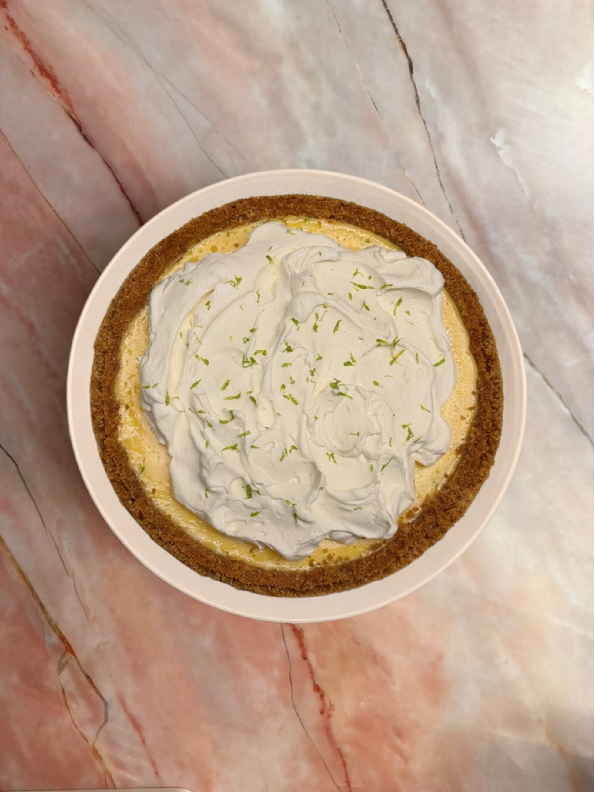

<!-- Desktop background video -->

  <video autoplay muted loop playsinline>
    <source src="../Backgroundrotating.mp4" type="video/mp4">
  </video>

# Key Lime Pie

      Bright, creamy, and refreshing: a classic key lime filling with a silky texture and just the right tang. Set in a buttery crumb crust and finished for that clean citrus snap – light, punchy, and perfect year-round, baked in Zürich with good ingredients and a lot of care.

<ul>
<li><strong>Size:</strong> 24 cm (45 CHF)</li>
<li><strong>Lead time:</strong> 72 hours pre-order</li>
</ul>

  <a href="order-pies-zurich.qmd" class="btn-link">Order</a>

  <a href="key_lime_pie_zurich.html">English</a> |
  <a href="de/key_lime_pie_zurich.html">Deutsch</a>

  <i class="fas fa-heart"></i>

